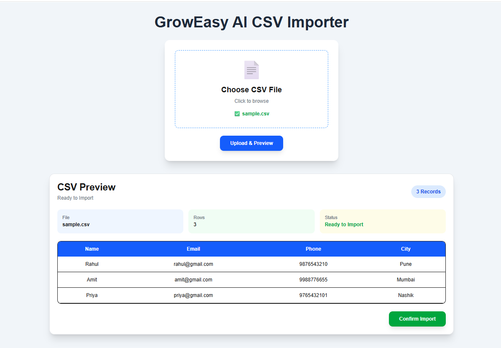
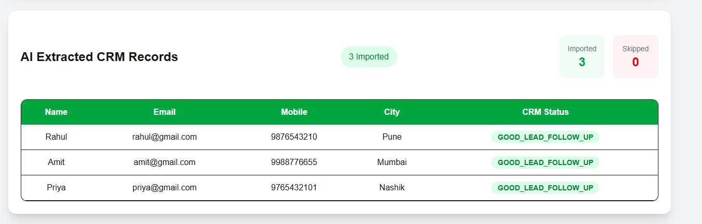

# GrowEasy AI CSV Importer

## Project Overview

This project is an AI-powered CSV Importer built for the GrowEasy Assignment.

Users can upload a CSV file, preview the data, send it to an AI model, and receive structured CRM records.

---

## Features

- CSV Upload
- CSV Preview
- AI CRM Data Extraction
- Imported Records
- Skipped Records Count
- Responsive UI
- Error Handling

---

## Tech Stack

### Frontend

- Next.js
- React
- Tailwind CSS
- Axios

### Backend

- Node.js
- Express.js
- Multer
- PapaParse
- Groq API

---

## Project Structure

```
GrowEasy-Assignment
│
├── frontend
│
└── backend
```

---

## Installation

### Backend

```bash
cd backend
npm install
node server.js
```

### Frontend

```bash
cd frontend
npm install
npm run dev
```

---

## Environment Variables

Create a `.env` file inside the backend folder.

```env
GROQ_API_KEY=your_api_key
```

---

## Workflow

1. Upload CSV
2. Preview CSV
3. Click Confirm Import
4. AI converts CSV into CRM JSON
5. Display Imported Records

## Screenshots

### CSV Preview


### AI Extracted CRM Records


## Author

Jagtap Vaishnavi Bhausaheb